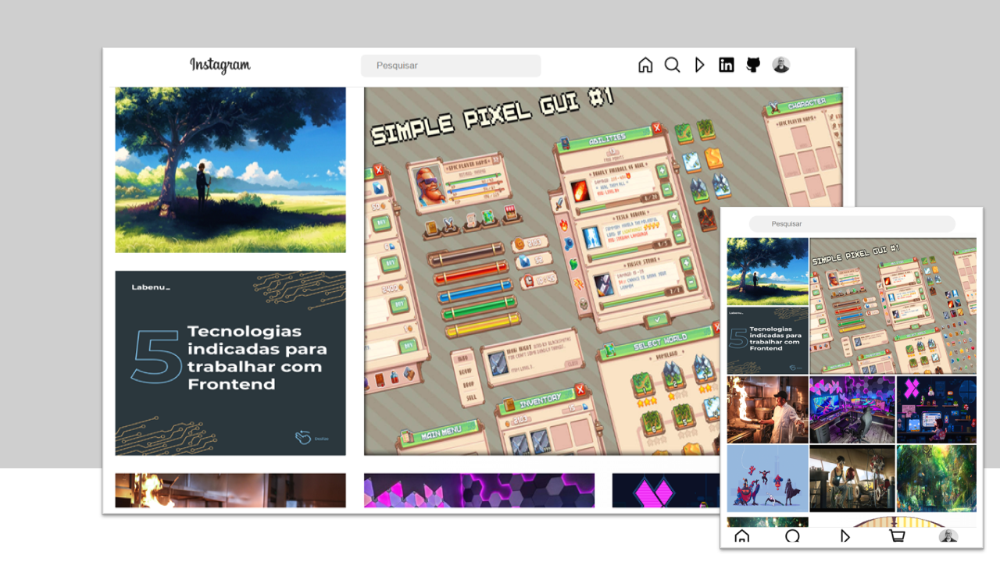

### Template Página do Instagram

## Sobre o projeto
Projeto de estudo elaborado para prática de posicionamento de elementos com a propriedade "display: grid", assim como reposicionamento da página de acordo com o tamanho da tela do usuário.

[Clique aqui para acessar]([Clique aqui para acessar](https://danielemidio1988.github.io/Formulario-de-Pesquisa/))

## Tecnologias

- HTML
- CSS
- Git e Github

## Contato

emidio.daniel@hotmail.com

